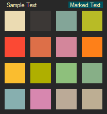

This theme can be installed via the HexChat Theme Manager, or you can manually extract the contents of Darktooth.hct
into your config folder. This theme has been reviewed by [the creator](https://github.com/jasonm23) of the Darktooth
theme.

#### Preview:

